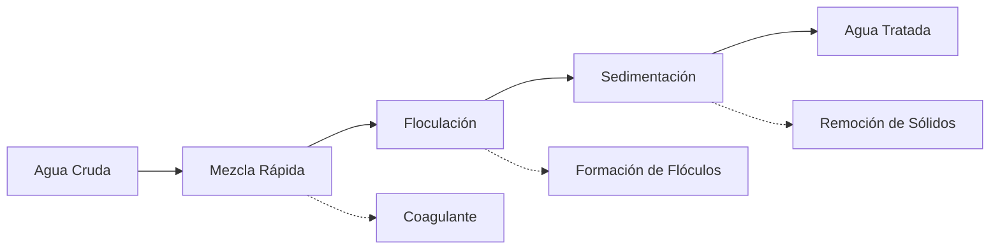
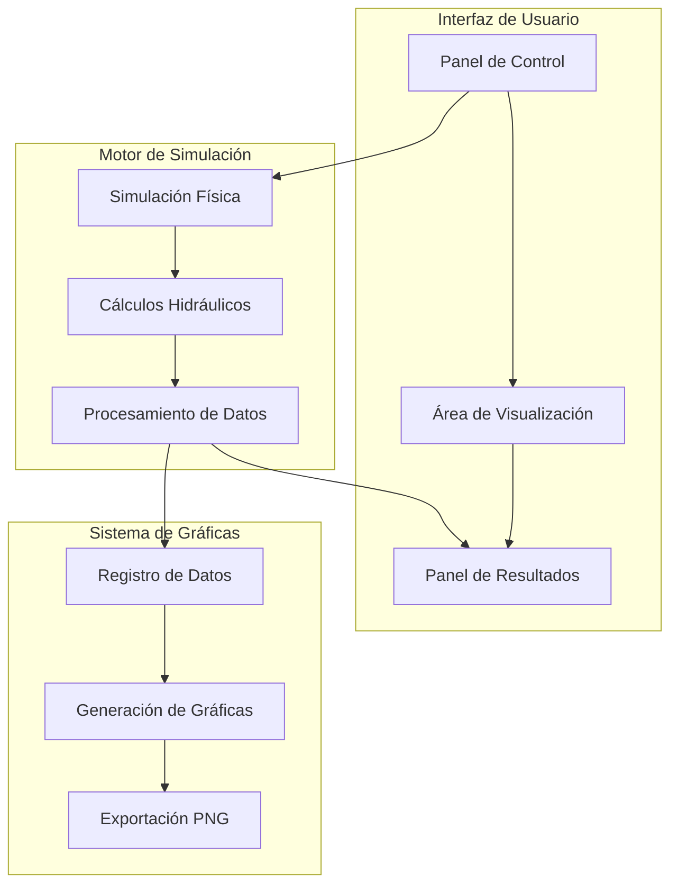

# 🌊 Simulador de Planta de Tratamiento de Aguas Residuales

<div align="center">


### *Sistema de Mezcla y Sedimentación para el Tratamiento Eficiente del Agua*

[🎥 Ver Demo](#-demo) • [📊 Características](#-características) • [🚀 Instalación](#-instalación) • [📖 Documentación](#-documentación)

</div>

---

## 📋 Tabla de Contenidos

- [🎯 Descripción del Proyecto](#-descripción-del-proyecto)
- [👥 Equipo de Desarrollo](#-equipo-de-desarrollo)
- [🎥 Demo](#-demo)
- [📊 Características](#-características)
- [🏗️ Arquitectura del Sistema](#️-arquitectura-del-sistema)
- [🚀 Instalación](#-instalación)
- [💻 Uso del Simulador](#-uso-del-simulador)
- [📈 Sistema de Gráficas](#-sistema-de-gráficas)
- [🔬 Base Científica](#-base-científica)
- [📁 Estructura del Proyecto](#-estructura-del-proyecto)
- [🤝 Contribuciones](#-contribuciones)
- [📄 Licencia](#-licencia)

---

## 🎯 Descripción del Proyecto

El **Simulador de Planta de Tratamiento de Aguas Residuales** es una herramienta educativa e interactiva desarrollada para simular procesos reales de tratamiento de agua mediante sistemas de **mezcla rápida**, **floculación** y **sedimentación**. 

Este simulador permite a estudiantes, ingenieros y profesionales del área visualizar y comprender los procesos físico-químicos involucrados en el tratamiento de aguas residuales, proporcionando una experiencia inmersiva con parámetros ajustables en tiempo real.

### 🎯 Objetivos

- **Educativo**: Facilitar el aprendizaje de procesos de tratamiento de agua
- **Interactivo**: Permitir experimentación con diferentes parámetros operativos
- **Realista**: Simular condiciones y dimensiones de plantas piloto reales
- **Visual**: Proporcionar retroalimentación visual inmediata de los procesos

---

## 👥 Equipo de Desarrollo

<div align="center">

### 🎓 **Asignatura: Water Treatment**
### 👨‍🏫 **Profesor: Victor Lozcano**

</div>

<table align="center">
<tr>
<td align="center">
<br />
<sub><b>Sharon Agudelo Hernández</b></sub><br />
<a href="https://www.linkedin.com/in/sharon-agudelo-hernandez-76980b382">💼 LinkedIn</a><br />
<a href="mailto:sharon.agudelo01@usa.edu.co">📧 Email</a>
</td>
<td align="center">
<br />
<sub><b>Carlos Guillermo Porras Molina</b></sub><br />
<a href="https://www.linkedin.com/in/carlos-guillermo-porras-molina-042701303/">💼 LinkedIn</a><br />
<a href="mailto:Carlos.porras01@usa.edu.co">📧 Email</a>
</td>
</tr>
<tr>
<td align="center">
<br />
<sub><b>Juanesteban Mariño</b></sub><br />
<a href="mailto:juanesteban.marino01@usa.edu.co">📧 Email</a>
</td>
<td align="center">
<br />
<sub><b>Guillermo López</b></sub><br />
<a href="mailto:Guillermo.lopez02@usa.edu.co">📧 Email</a>
</td>
</tr>
</table>

---
### 🎮 Funcionalidades Demostradas
## 🎥 D**Video Demostrativo del Simulador**


<div align="center">

https://github.com/user-attachments/assets/2defeba2-7a94-4a0b-8632-fd48df6b8983

*Video demostrativo mostrando el funcionamiento completo del simulador de tratamiento de agua*

</div>

### 🎮 Funcionalidades Demostradas

- ✅ Simulación en tiempo real de procesos de tratamiento
- ✅ Ajuste dinámico de parámetros operativos
- ✅ Visualización de partículas y flujo de agua
- ✅ Generación automática de gráficas de monitoreo
- ✅ Cálculos hidráulicos basados en dimensiones reales

---

## 📊 Características

### 🔧 **Características Técnicas**

| Característica | Descripción |
|----------------|-------------|
| **Simulación en Tiempo Real** | Visualización dinámica de procesos de tratamiento |
| **Parámetros Ajustables** | Control de caudal, dosis de coagulante, pH, temperatura |
| **Cálculos Hidráulicos** | Basados en ecuaciones de ingeniería sanitaria |
| **Gráficas Interactivas** | Monitoreo de eficiencia, turbidez, color y sedimentación |
| **Dimensiones Reales** | Basado en especificaciones de plantas piloto |
| **Interfaz Intuitiva** | Controles fáciles de usar con retroalimentación visual |

### 🏭 **Procesos Simulados**



#### 1. **Mezcla Rápida** 🌪️
- **Dimensiones**: 23×23×24 cm
- **Volumen**: 12.2 L
- **Función**: Dispersión homogénea del coagulante
- **Parámetros**: Gradiente G, tiempo de mezcla

#### 2. **Floculación** 🔄
- **Dimensiones**: 30×14×24 cm  
- **Volumen**: 9.7 L
- **Función**: Formación de flóculos
- **Elementos**: 7 bafles para mezcla lenta

#### 3. **Sedimentación** ⬇️
- **Dimensiones**: 30×14×24 cm
- **Volumen**: 9.7 L
- **Función**: Separación sólido-líquido
- **Elementos**: Piso falso con 55 orificios de 2mm

---

## 🏗️ Arquitectura del Sistema



### 🧩 **Componentes Principales**

- **`game_visualization.py`**: Motor principal del simulador
- **`pilot_plant_simulation.py`**: Lógica de simulación científica
- **`plant_graphs.py`**: Sistema de gráficas y monitoreo
- **`pilot_plant_config.py`**: Configuraciones y parámetros
- **`water_treatment_simulation.py`**: Algoritmos de tratamiento

---

## 🚀 Instalación

### 📋 **Requisitos del Sistema**

- **Python**: 3.8 o superior
- **Sistema Operativo**: Windows, macOS, Linux
- **RAM**: Mínimo 4GB recomendado
- **Espacio en Disco**: 500MB

### 🔧 **Instalación Paso a Paso**

1. **Clonar el repositorio**
   ```bash
   git clone https://github.com/tu-usuario/simulador-tratamiento-agua.git
   cd simulador-tratamiento-agua
   ```

2. **Crear entorno virtual** (recomendado)
   ```bash
   python -m venv venv
   
   # Windows
   venv\Scripts\activate
   
   # macOS/Linux
   source venv/bin/activate
   ```

3. **Instalar dependencias**
   ```bash
   pip install -r requirements.txt
   ```

4. **Ejecutar el simulador**
   ```bash
   python game_visualization.py
   ```

### 📦 **Dependencias Principales**

```txt
pygame>=2.1.0
numpy>=1.21.0
matplotlib>=3.5.0
pandas>=1.3.0
scipy>=1.7.0
```

---

## 💻 Uso del Simulador

### 🎮 **Controles Básicos**

| Acción | Control |
|--------|---------|
| **Iniciar Simulación** | Botón "INICIAR" |
| **Pausar** | Botón "PAUSAR" |
| **Reiniciar** | Botón "RESET" |
| **Generar Gráficas** | Botón "GENERAR GRAFICAS" |
| **Configuraciones** | Botón "CONFIGURACIONES" |

### ⚙️ **Parámetros Ajustables**

#### 🌊 **Parámetros del Agua**
- **Caudal**: 0.1 - 1.0 L/s
- **Turbidez Inicial**: 10 - 100 NTU
- **pH**: 6.0 - 9.0
- **Temperatura**: 15 - 30°C

#### 🧪 **Parámetros Operativos**
- **Dosis de Coagulante**: 0.01 - 0.1 g/L
- **Velocidad de Simulación**: 1x - 50x
- **Tiempo de Retención**: Calculado automáticamente

### 📊 **Interpretación de Resultados**

#### 🎯 **Indicadores de Calidad**

| Parámetro | Excelente | Bueno | Requiere Ajuste |
|-----------|-----------|-------|-----------------|
| **Eficiencia** | >90% | 80-90% | <80% |
| **Turbidez Final** | <1 NTU | 1-5 NTU | >5 NTU |
| **Color** | <5 Pt-Co | 5-15 Pt-Co | >15 Pt-Co |
| **pH Final** | 6.5-8.5 | 6.0-9.0 | Fuera de rango |

---

## 📈 Sistema de Gráficas

### 📊 **Gráficas Disponibles**

1. **Velocidad de Sedimentación** (mm/s)
2. **Eficiencia del Sistema** (%)
3. **Turbidez del Efluente** (NTU)
4. **Color del Efluente** (Pt-Co)
5. **pH del Sistema**
6. **Parámetros Operativos**

### 🎛️ **Controles de Gráficas**

- **ESC**: Cerrar ventana de gráficas
- **S**: Guardar como PNG
- **R**: Actualizar datos

### 📈 **Ejemplo de Gráficas**

```
[Las gráficas muestran tendencias en tiempo real de todos los parámetros]
```

---

## 🔬 Base Científica

### 📚 **Fundamentos Teóricos**

#### 🧮 **Ecuaciones Implementadas**

1. **Velocidad de Sedimentación (Stokes)**
   ```
   vs = g × d² × (ρp - ρw) / (18 × μ)
   ```

2. **Gradiente de Velocidad (G)**
   ```
   G = √(P / (μ × V))
   ```

3. **Criterio de Camp (Floculación)**
   ```
   G × t = 10,000 - 100,000 (óptimo)
   ```

4. **Tasa de Carga Superficial**
   ```
   SOR = Q / A (m/h)
   ```

### 📖 **Referencias Científicas**

- Camp, T.R. & Stein, P.C. (1943). Velocity gradients and internal work in fluid motion
- Hazen, A. (1904). On sedimentation
- Smoluchowski, M. (1917). Versuch einer mathematischen Theorie der Koagulationskinetik
- Fair, G.M. & Geyer, J.C. (1954). Water Supply and Waste-Water Disposal

---

## 📁 Estructura del Proyecto

```
simulador-tratamiento-agua/
├── 📄 README.md                          # Este archivo
├── 📄 requirements.txt                   # Dependencias
├── 🐍 game_visualization.py             # Simulador principal
├── 🐍 pilot_plant_simulation.py         # Simulación científica
├── 🐍 plant_graphs.py                   # Sistema de gráficas
├── 🐍 pilot_plant_config.py             # Configuraciones
├── 🐍 water_treatment_simulation.py     # Algoritmos base
├── 📁 docs/                             # Documentación
│   ├── 📄 README_GRAFICAS.md           # Guía de gráficas
│   └── 📄 README_3D.md                 # Visualización 3D
├── 📁 tests/                            # Pruebas
│   ├── 🐍 test_graphs.py               # Prueba de gráficas
│   └── 🐍 test_simulation.py           # Prueba de simulación
└── 📁 examples/                         # Ejemplos
    ├── 🐍 example_usage.py             # Uso básico
    └── 🐍 demo_visualizations.py       # Demostraciones
```

---

## 🤝 Contribuciones

### 🛠️ **Cómo Contribuir**

1. **Fork** el proyecto
2. Crea una **rama** para tu feature (`git checkout -b feature/AmazingFeature`)
3. **Commit** tus cambios (`git commit -m 'Add some AmazingFeature'`)
4. **Push** a la rama (`git push origin feature/AmazingFeature`)
5. Abre un **Pull Request**

### 🐛 **Reportar Bugs**

Si encuentras un bug, por favor abre un **issue** con:
- Descripción detallada del problema
- Pasos para reproducir
- Capturas de pantalla (si aplica)
- Información del sistema

### 💡 **Sugerir Mejoras**

¡Tus ideas son bienvenidas! Abre un **issue** con la etiqueta `enhancement`.

---

## 📄 Licencia

Este proyecto está bajo la Licencia MIT. Ver el archivo `LICENSE` para más detalles.

```
MIT License

Copyright (c) 2024 Equipo de Desarrollo - Water Treatment Simulator

Permission is hereby granted, free of charge, to any person obtaining a copy
of this software and associated documentation files (the "Software"), to deal
in the Software without restriction, including without limitation the rights
to use, copy, modify, merge, publish, distribute, sublicense, and/or sell
copies of the Software, and to permit persons to whom the Software is
furnished to do so, subject to the following conditions:

The above copyright notice and this permission notice shall be included in all
copies or substantial portions of the Software.
```

---

<div align="center">

### 🌟 **¡Gracias por usar nuestro simulador!** 🌟

**Desarrollado con ❤️ por estudiantes de Ingeniería**

[⬆️ Volver al inicio](#-simulador-de-planta-de-tratamiento-de-aguas-residuales)

---


</div>
